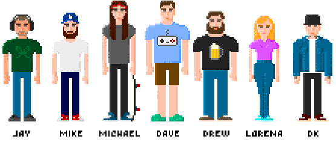

# The Genus Team
Genus was developed with love by the following team members:

## Credits

### Programming:
[Mike Schwartz](https://github.com/mschwartz)\
[Michael Tintiuc](https://github.com/michaeltintiuc)\
[Jay Garcia](https://github.com/jaygarcia)\
[Richard Bullington-McGuire](https://github.com/obscurerichard)
 
### Gameplay:
[Mike Schwartz](https://github.com/mschwartz)\
[Michael Tintiuc](https://github.com/michaeltintiuc)\
[Jay Garcia](https://github.com/jaygarcia)\
[Dymtro Kovalenko](https://dribbble.com/tasteofdalife)\
[Jonathan Van Dalen](https://dribbble.com/tasteofdalife)

### Visual Design:
[Drew Griffith](https://dribbble.com/DrewGriffith)\
[Lorena Vargas](https://dribbble.com/olorenav)\
[Dymtro Kovalenko](https://dribbble.com/tasteofdalife)\
[Jonathan Van Dalen](https://www.linkedin.com/in/jon-van-dalen-22a15aa/)

### Music and sound effects:
[Jay Garcia](https://github.com/jaygarcia)

### Project management:
[Dave Collins](https://github.com/davecollins)

### Additional development:
[Don Anderson](https://github.com/dranderson)\
[Housni Yakoob](https://github.com/housni)\
[Richard Bullington-McGuire](https://github.com/obscurerichard)

### Shout out:
[Claudio Matsuoka](https://github.com/cmatsuoka) - Thank you for fixing issues with LibXMP so rapidly! ❤️

## Licensed visuals
We used the following backgrounds licensed under Creative Commons attribution licenses (version 3.0 and 4.0) and have also donated to their respective authors as a thank you to them!

[Creative Commons 4.0](https://creativecommons.org/licenses/by/4.0/)\
Stage 1 - [Countryside](http://pixelgameart.org/web/portfolio/country-side-platfformer/)\
Stage 2 - [Under Water](http://pixelgameart.org/web/portfolio/underwater-diving)\
Stage 3 - [Glacial Mountains](https://vnitti.itch.io/glacial-mountains-parallax-background)\
Stage 4 - [Under Water Fantasy](http://pixelgameart.org/web/portfolio/underwater-fantasy-pixel-art-environment/)\
Stage 5 - [Cyberpunk Street](http://pixelgameart.org/web/portfolio/cyberpunk-street-environment/)

[Creative Commons 3.0](https://creativecommons.org/licenses/by/3.0/)\
Stage 6 - [Spaaaaaaace](https://opengameart.org/content/spaaaaaaace-scene)
