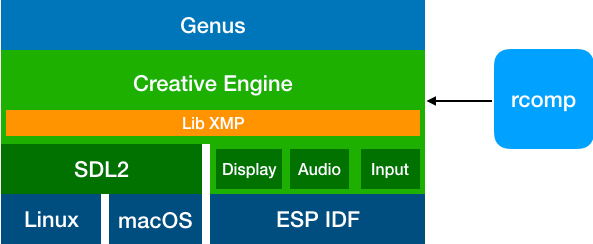

# Developing

This document's purpose is to provide a high-level understanding of how Genus work. Programmers wishing to contribute must review our [contributing](./CONTRIBUTING.md) guidelines as well as have a decent understanding of C++ and some knowledge of SOCs, such as the [ESP32-WROVER](https://docs.espressif.com/projects/esp-idf/en/latest/get-started/get-started-wrover-kit.html). 

# How genus works

Genus is a cross-platform a puzzle game created by [Modus Create](https://moduscreate.com) for the 2018 holiday sesaon. Genus runs on the [ODROID GO](https://www.hardkernel.com/shop/odroid-go/), macOS and Linux. 

The following visualization depicts the layers of the various libraries at play.


#### All platforms
[Genus](https://github.com/moduscreateorg/genus) this game.\
[Creative Engine](https://github.com/ModusCreateOrg/creative-engine) is the game engine. It implements LibXMP, SDL2, ESP-IDF (Audio, Video and Input drivers).\
[LibXMP](http://xmp.sourceforge.net/) is a fantastic cross-platform library for playing music using the [Xtended Module (XM)](https://en.wikipedia.org/wiki/XM_(file_format)) format and also has additional functionality to play sound effects.\
[rcomp](https://github.com/ModusCreateOrg/creative-engine) is a CLI program that takes graphic and audio resources and packages them into a binary blob to be included and is part of the Creative Engine library.

#### macOS, Linux
[SDL2](https://www.libsdl.org/download-2) is a cross-platform low-level media layer framework. Creative Engine generates audio data with LibXMP and feeds it into the SDL2 audio runloo and does similar to present visuals in the application window as well as poll for keyboard input to allow for gameplay.

#### ODROID GO
[Espressif IoT development Framework (ESP IDF)](https://github.com/espressif/esp-idf) is a low level framework for accessing capabilities of the ESP32-WOVER SOC.


# Getting started
Let's get setup for desktop and device development. To do so, we'll need to ensure that we have the right 
al libraries and tools installed.

We're going to get setup in three phases:
1. Clone Genus and Creative Engine
2. Install supporting desktop libraries and tools
3. Install ESP IDF toolchain (this is only needed if you want to program an ODROID GO)

## Clone Genus and Creative Engine
The first thing we need to is create a folder that will contain Genus and Creative engine. When we're done, the folder struction will look similar to the following.

    projects/
        |-genus/                # Source for Genus
            |-creative-engine/  # Source Creative Engine

Let's clone the Genus and Creative Engine repos:
    mkdir genus-game/                                             # Whould be within ~/projects or similar
    git clone git@github.com:ModusCreateOrg/genus.git
    cd genus/
    git clone git@github.com:ModusCreateOrg/creative-engine.git 
   
## Install dependencies

### macOS
- [ ] Install [XCode](https://developer.apple.com/xcode/)
- [ ] Intall [Homebrew](https://brew.sh) 
    /usr/bin/ruby -e "$(curl -fsSL https://raw.githubusercontent.com/Homebrew/install/master/install)"
- [ ] Install final dependencies
```    
# Run this command from genus/
brew install
```
- [ ] Build and run Genus
```    
# Run this command from genus/
scripts/build.sh -o                             # Build it
```

### Linux (Debian based)
- [ ] Install dependencies
```
sudo apt-get install libsdl2-dev libsdl2-image-dev cmake g++ -y
```
- [ ] Build and run Genus
```    
# Run this command from genus/
scripts/build.sh -o                             # Build it
```

## ODROID GO/ESP32
- [ ] Follow the [setup-toolchain](https://docs.espressif.com/projects/esp-idf/en/stable/get-started/#setup-toolchain) instructions. Be sure to follow them thorougly! 
- [ ] Stage the appropriate SDK config file
```
# Linux ONLY
cp sdkconfig.linux sdkconfig
# macOS ONLY
cp sdkconfig.mac sdkconfig
```
- [ ] Build and run genus 
```
#From within genus/
make -j 4 flash   #Assuming you have four CPU cores to compile
```

## Additional information
We highly recommend using the [CLion IDE](https://www.jetbrains.com/clion/) to develop the project and run the builds.


## Git Workflow
Read about [GitHub workflow](https://github.com/ModusCreateOrg/creative-engine) at the creative-engine repo.

The gist is that we fork the main repos and work in our private forks.  We push to our forks.  We create Pull Requests against the main repos.

The only way code makes it into master in the main repo is if we merge a PR.
