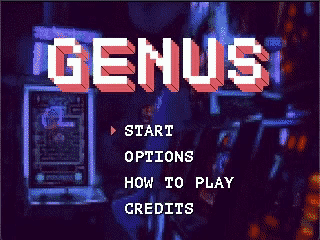
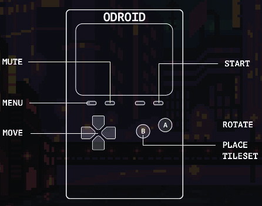

# Genus 

Genus is a cross-platform a puzzle game created by [Modus Create](https://moduscreate.com) for the 2018 holiday season. Genus runs on the [ODROID GO](https://www.hardkernel.com/shop/odroid-go/), macOS and Linux.

## How to Play
Genus is a simple puzzle game where the objective is to match colors in 2x2 patterns. Once a 2x2 pattern is found, the blocks will be darken as they are marked for clearing and a bonus timer will appear. If you create additional create additional color matches while the bonus timer is counting down, your score will increase.  Play until you run out of spaces to place new blocks.  

The game's difficulty increases as you progress through levels. There are a total of six stages in the game, each with different backgrounds, songs and color themes.

Here's the button mapping for the ODROID GO.

## Keymap for computer-based players:

#### Global (all screens)
| Key(s) | Description |
| --- | --- |
| `Q` | Quits the game |
| `2` | Mute / Unmute audio |
| `3` | Move menu cursor down |

#### Main Menu
| Key(s) | Description |
| --- | --- |
| `1` | Shortcut to enter Options from the main menu |
| `↑ ↓` | Move menu cursor |
| `4` `RETURN` `X` `Z` `SPACE` | Select item in the menu |

#### Options Screen
| Key(s) | Description |
| --- | --- |
| `1` | Exit options |

### Instructions screens
| Key(s) | Description |
| --- | --- |
| `← →` | Navigate how to play screens |

### Game
| Key(s) | Description |
| --- | --- |
|`← → ↑ ↓` | Moves the bocks |
| `Z` | Rotate the blocks |
| `X` `SPACE` | Place blocks on the gameboard |

## License
Genus is licensed under [GPL v3](https://www.gnu.org/licenses/quick-guide-gplv3.en.html).

# Contributing
Interested in contributing to Genus? Please see our [developing](./DEVELOPING.md) and [contributions](./CONTRIBUTIONS.MD) guidelines. 
