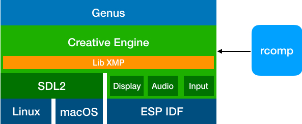

# Developing
This document's purpose is to provide a high-level understanding of how Genus work. Programmers wishing to get involved should review our [contributions](./CONTRIBUTING.md) guidelines as well as have a decent understanding of C++ and build tools. Having some knowledge of SOCs, such as the [ESP32-WROVER](https://docs.espressif.com/projects/esp-idf/en/3.2/get-started/get-started-wrover-kit.html) would also be very helpful. 

*Note* We've standardized on ESP-IDF version 3.2:
https://github.com/espressif/esp-idf/releases/tag/v3.2
https://docs.espressif.com/projects/esp-idf/en/v3.2/


## How Genus works
Genus is a cross-platform a puzzle game created by [Modus Create](https://moduscreate.com) for the 2018 holiday season. Genus runs on the [ODROID GO](https://www.hardkernel.com/shop/odroid-go/), macOS and Linux. 

Building Genus has been tested on the `x86_64` architecture with macOS X High Sierra and Mojave, Ubuntu 16.04 and 18.04, and on the `armhf` architecture with Raspbian Stretch (9.6).

The following visualization depicts the layers of the various libraries at play.


The following is a list of dependencies for each platform.

### Dependencies (All platforms)
[Genus](https://github.com/moduscreateorg/genus), this game.\
[Creative Engine](https://github.com/ModusCreateOrg/creative-engine) is the game engine developed by Modus Create. It implements LibXMP, SDL2, ESP-IDF (Audio, Video and Input drivers).\
[LibXMP](http://xmp.sourceforge.net/) is a fantastic cross-platform library for playing music using the [Xtended Module (XM)](https://en.wikipedia.org/wiki/XM_(file_format)) format and also has additional functionality to play sound effects.\
[Rcomp](https://github.com/ModusCreateOrg/creative-engine/blob/master/tools/rcomp.cpp) is a CLI tool that takes any binary resources and packages  (graphic, audio, etc.) them into a binary blob to be included in the game executable and is part of [Creative Engine](https://github.com/ModusCreateOrg/creative-engine).

#### macOS, Linux
[SDL2](https://www.libsdl.org/download-2) is a cross-platform low-level media layer framework. Creative Engine generates audio data with LibXMP and feeds it into the SDL2 audio runloo and does similar to present visuals in the application window as well as poll for keyboard input to allow for gameplay.

#### ODROID GO
[Espressif IoT development Framework (ESP IDF)](https://github.com/espressif/esp-idf) is a low level framework for accessing capabilities of the ESP32-WOVER SOC.


## Getting started
Let's get setup for desktop and device development. To do so, we'll need to ensure that we have the right libraries and tools installed.

We're going to get setup in three phases:
1. Clone Genus and Creative Engine
2. Install supporting desktop libraries and tools
3. Install ESP IDF toolchain (this is only needed if you want to program an ODROID GO)

## Clone Genus and Creative Engine
The first thing we need to is create a folder that will contain Genus and Creative engine. When we're done, the folder struction will look similar to the following.

    projects/
        |-genus-game/
            |-creative-engine/      # Source Creative Engine
            |-genus/                # Source for Genus
                |-creative-engine/  # Symbolic Link to ../creative-engine/

Let's clone the Genus and Creative Engine repos:

    # Would be within ~/projects or similar
    mkdir genus-game/                                          
    cd genus-game/
    git clone git@github.com:ModusCreateOrg/genus.git
    git clone git@github.com:ModusCreateOrg/creative-engine.git
    ln -s creative-engine/ genus/creative-engine                  # Create Symbolic Link
   
## Install dependencies

### macOS
- [ ] Install [XCode](https://developer.apple.com/xcode/) CLI tools
    
```
xcode-select --install
``` 
  
- [ ] Install [Homebrew](https://brew.sh)

```
/usr/bin/ruby -e "$(curl -fsSL https://raw.githubusercontent.com/Homebrew/install/master/install)"`
```
- [ ] Install final dependencies via HomeBrew
```    
# Run this command from genus/
brew install
scripts/build.sh                             # Build Genus
open build/genus.app                         # Run Genus
```

### Linux (Debian based)
The Debian based build, usable on Debian Stretch and Ubuntu 16.04+, will install development tool dependencies and complete the build in one step.

Running the `build.sh` script will download all development dependencies, including `libsdl2-dev`, `libsdl2-image-dev`, development tools including `g++`, and will install `cmake` from either a precompiled binary or from source if a binary is not available for your architecture.

- [ ] Build and run Genus
```    
# Run this command from genus/
scripts/build.sh               # Build Genus
build/genus                    # Run Genus
```

### Raspberry Pi
Genus runs on Raspbian Stretch (9.6) on the Raspberry Pi 2B+ and 3B+. You will need about 2GB of space in /tmp and about 2GB of space in /home to build this.

The game will run very slowly without enabling the OpenGL desktop driver. You can enable it by running `sudo raspbi-config` and choosing _Advanced Options / GL Driver / GL (Full KMS)_. The game will run very slowly without enabling the OpenGL desktop driver. You can enable it by running `sudo raspbi-config` and choosing _Advanced Options / GL Driver / GL (Full KMS)_. See this site for complete instructions:  [https://eltechs.com/how-to-enable-opengl-on-raspberry-pi/](https://eltechs.com/how-to-enable-opengl-on-raspberry-pi/).


The `build.sh` script will download all development dependencies, including `libsdl2-dev`, `libsdl2-image-dev`, development tools including `g++`, and will install `cmake` from source.

- [ ] Install dependencies, build and run Genus

```
# Run this command from genus/
scripts/build.sh               # Build Genus
build/genus                    # Run Genus
```

The first time the build runs it will have to build `cmake` from source which takes a long time. It will install `cmake` in `/usr/local/bin/cmake`.

## ODROID GO/ESP32
- [ ] The following script replicates the steps to install the related ESP-IDF software. See the [setup-toolchain](https://docs.espressif.com/projects/esp-idf/en/stable/get-started/#setup-toolchain) instructions details.
 
__Note:__ We've standardized on ESP-IDF version 3.2, and have deviated a bit from the install instructions.

```
# To install ESP-IDF, please execute the following command:
# Assumes you don't have an esp directory in your profile directory
bash scripts/download-esp-idf.sh

```
To proceed further, __make sure__ your [$IDF_PATH](https://docs.espressif.com/projects/esp-idf/en/latest/get-started/add-idf_path-to-profile.html#linux-and-macos) environment variable is set.

Next, close & re-open your terminal.
To proceed further, __make sure__ your [$IDF_PATH](https://docs.espressif.com/projects/esp-idf/en/latest/get-started/add-idf_path-to-profile.html#linux-and-macos) environment variable is set.

Next, close & re-open your terminal.

Last step is to execute the following command to update the IDF Python scripts. This will only work if your `$IDF_PATH` is properly set.

```
python -m pip install --user -r $IDF_PATH/requirements.txt
```

Last step is to execute the following command to update the IDF Python scripts. This will only work if your `$IDF_PATH` is properly set.

```
python -m pip install --user -r $IDF_PATH/requirements.txt
```

- [ ] Stage the appropriate SDK config file
```
# From within genus/
# Linux ONLY
cp sdkconfig.linux sdkconfig

# macOS ONLY
cp sdkconfig.mac sdkconfig
```
- [ ] Build and run genus 
```
# From within genus/ 
# Ensure your device is plugged in and powered on.
make rcomp resources        # Build necessary tooling & resources binary
make flash && make monitor  # Sit back, relax and enjoy the game.

# *IF* you are prompted by the build system to say yes or no to any configura†ion changes, 
# choose the default (press ENTER).
```

## Additional information
We highly recommend using the [CLion IDE](https://www.jetbrains.com/clion/) to develop the project and run the builds.


## Git Workflow
Read about [GitHub workflow](https://github.com/ModusCreateOrg/creative-engine) at the creative-engine repo.

The gist is that we fork the main repos and work in our private forks.  We push to our forks.  We create Pull Requests against the main repos.

The only way code makes it into master in the main repo is if we merge a PR.
